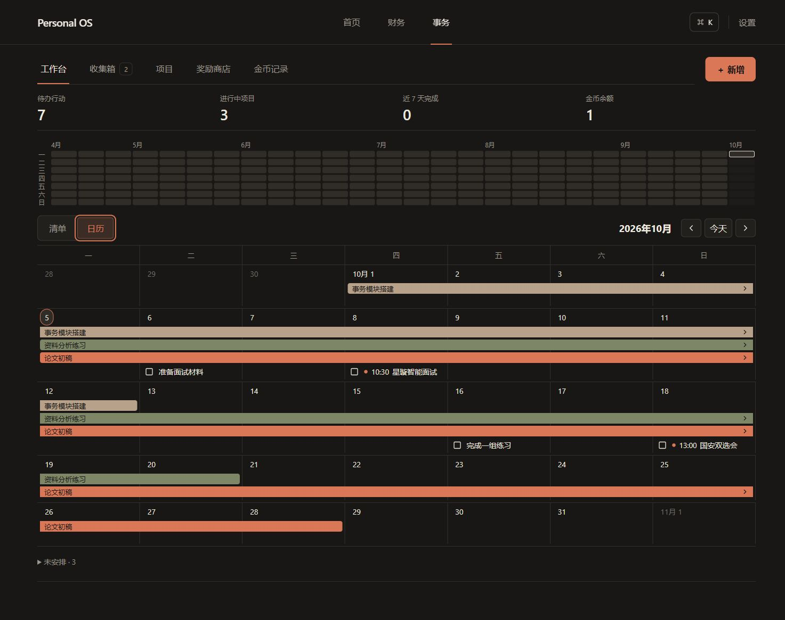

# 事务月历验证记录

2026-10-05，develop，基线 547deb0。正式库未执行迁移、未写测试记录、未发布；以下不等于生产验收。

| 检查 | 实际结果 |
| --- | --- |
| `npm run test` | 110 个文件，537/537 通过 |
| `npm run typecheck` | 通过 |
| `npm run lint` | 通过，无警告 |
| `npm run build` | Next.js 15.5.25 生产构建通过 |
| 本地 `affairs_schedule.mjs` | 新字段、View 列顺序/类型、旧请求重放、omission/null、各 RPC、约束、原子失败、RLS/anon 拒绝、零金币、Finance 不变，全部通过 |
| 本地 foundation / rewards / inbox SQL runners | 全部通过 |
| preflight / postflight | 隔离库验证单个可导出的 report JSON、6 个新列、无非法行 |
| `TZ=America/New_York` 下 schedule/location | 9/9 通过，日期不受设备时区/DST影响 |

SQL runner 参数为 `.affairs-test-runtime/node_modules/@electric-sql/pglite/dist/index.js`，不是数据库 URL。PGlite 不代表正式库或双会话并发验收。

TDD 覆盖新列缺失、结构化日期/钟点、旧 DTO、纯网格/范围/点位/未安排、完成无自动提交、未知刷新保留原 UUID、URL/前后退保护、日期预填、布局及周轨道回收。一次大 DOM 测试查询超过 5 秒，改为定位对应 toolbar 后全套通过；未提高全局超时或改变业务。

## 浏览器

Codex in-app browser 在隔离 Vite harness 中渲染实际产品组件。只有 harness 使用本地 fixture；产品没有 mock fallback、认证绕过或正式库写入，没有增加依赖。

源图与实现截图放在同一个比较输入中打开，调整后再次比较；本地详细报告 `design-qa.md`。

- 桌面 1488×1058、平板 768×1024、手机 390×844。截图 full-page，密度 1；桌面/平板实际宽度扣除 15px 滚动条，没有缩放。
- 三个尺寸无整页横向溢出。手机热力图自身滚动；七列月历和完整当日清单保留。
- next/today/back/forward、项目完整日期详情、Escape、完成确认、未知时阻止 Back、原请求重放回执、`+N`、未安排、空日预填 2026-10-22 且未保存，实际检查通过。
- 单元测试覆盖 dirty/pending/unknown 控件与历史导航保护。
- 干净标签页控制台 error/warn 为 0；早期 harness 热更新出现 3 条重复 createRoot 警告，重新加载不复现，非产品组件错误。

[平板](assets/affairs/month-calendar-tablet.jpg) · [手机](assets/affairs/month-calendar-mobile.jpg) · [完成回执](assets/affairs/month-calendar-confirmation.jpg)

## 实施调整

- Windows helper 无法创建盘符路径，使用等价 PowerShell 记录任务/日志；风险仅在过程记录。
- 先尝试跨月固定轨道，视觉检查发现结束项目遗留空轨道，恢复计划中的每周首个空轨道；记录颜色/标识稳定，但跨周条可能换垂直轨道。
- 既有确认面板增加可选初始打开/隐藏触发/关闭回调，保留刷新后消失对象的冻结请求；默认入口不变，风险是可选接口增量。

## 待上线核对

线上函数/View 尚未与仓库核对；新迁移未执行，不能宣称生产月历可用。先运行 [preflight](../supabase/checks/affairs_schedule_preflight.sql) 发回 report，再按 [使用说明](affairs-month-calendar-usage.md) 部署。真实 session/RLS 和录入/完成回执需迁移后验收，fixture 不替代这一步。

独立整分支审查正在进行，最终结果将追加。
